# PRODUCT DATA ENTRY PROJECT
__DESCRIPTION:__

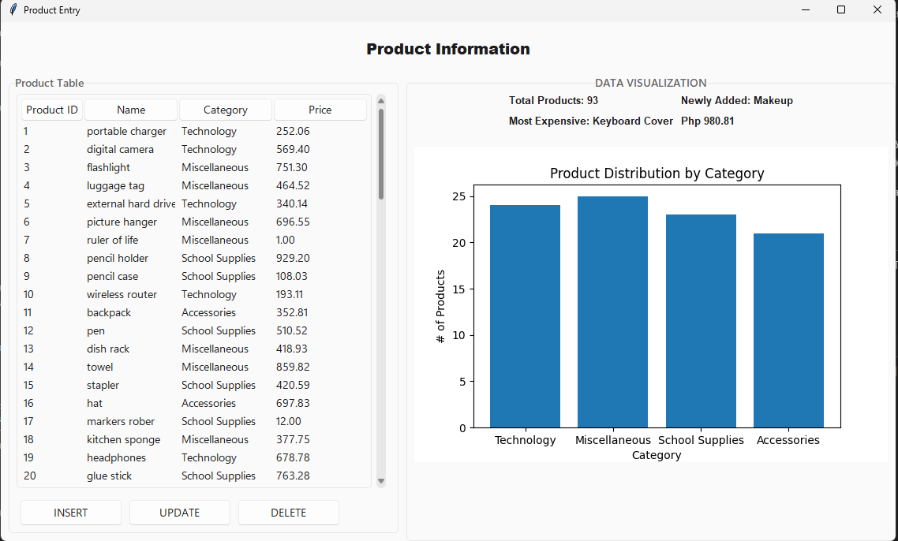

This project is designed to take in user input for product data and store it into a MySQL database. The program is built using Python and utilizes libraries: 
* **Tkinter (custom tkinter or TTK)**
* **pandas**
* **matplotlib**
* **mysql-connector**
* **sv_ttk** (appearance)

> The goal of the project is to provide a working product data entry form that the user can use to **CREATE**, **VIEW**, **UPDATE** and **DELETE** products (and product information) in a MySQL database using Python.

> This is a project on a basic level, yet incorporates the fundamental concepts in utilizing Python, on a virtual environment, and MySQL.

### DATABASE SCHEMA:
---
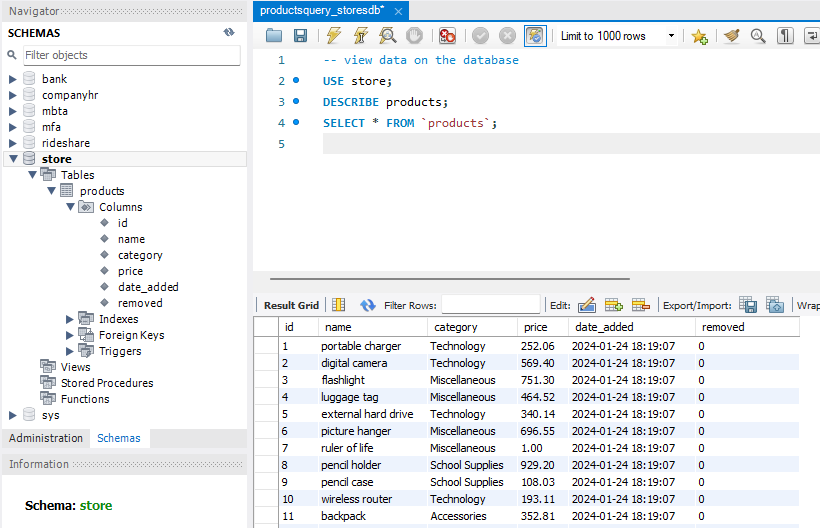

Database: store.db
Table: products
Columns: productID, name, price, category, price

Where:
> * **id** : primary
> * **name** : product name
> * **category**: category where the product belongs
> * **price**: price PER product

### SNAPSHOTS
----

#### CREATE (INSERT)

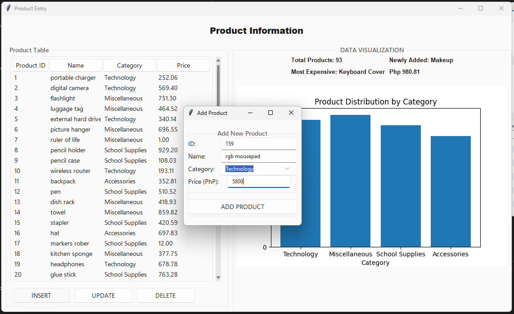

> Creating a product allows a user to insert a new product to the table. It is automatically displayed and added to the database and the tkinter treeview.

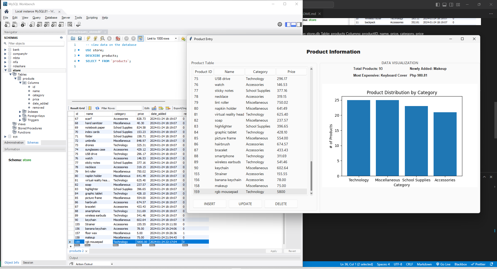

#### READ (VIEW)

> The view is the dashboard itself. It also includes a very basic bar graph showing the distribution of products per category. Labels above also indicates what product is newly added, and what is the most expensive data.

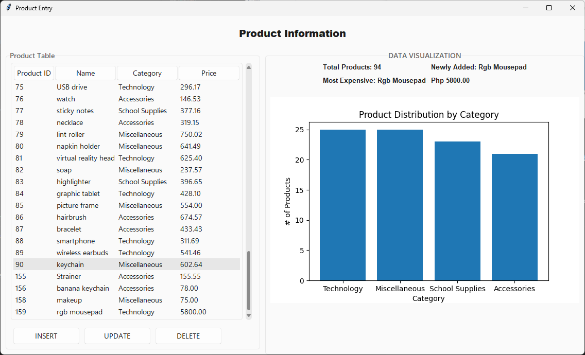

#### UPDATE

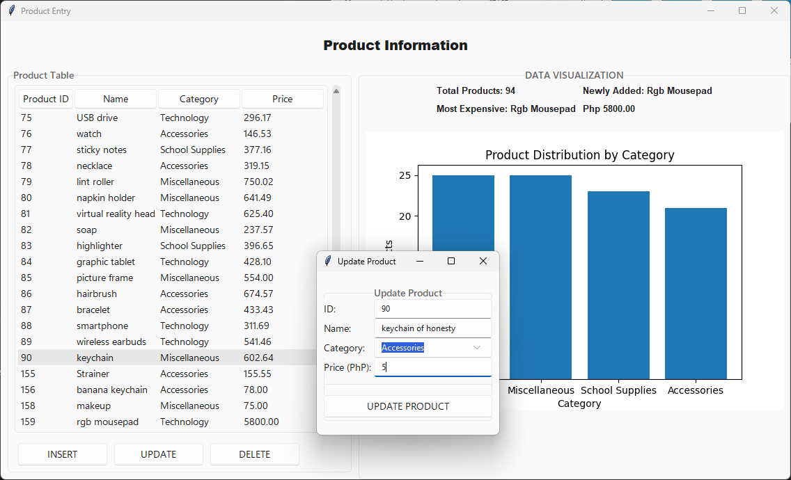

> The software is also capable of updating information which also reflects to the tkinter treeview and database.

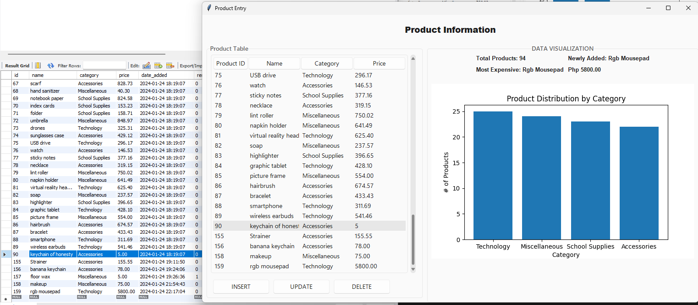

#### DELETE

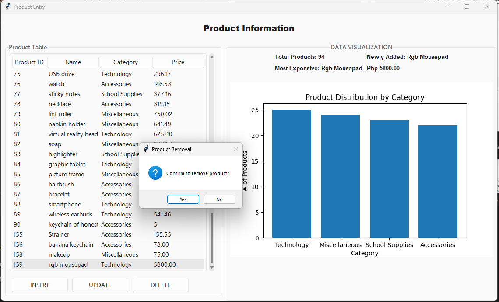
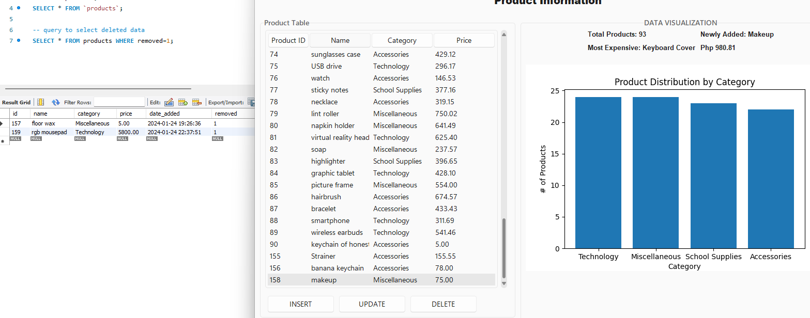

> Deleting removes data from the treeview, but it doesn't really remove the data on the database. 

> This technique is what I learned on the CS50 course for Introduction to Database with SQL by harvard. According to what they said, you don't really delete the data from the database unless you are doing extreme cleaning or if you're told to.

### CODE SNAPSHOTS
----

#### CREATING DATABASE USING PYTHON:

> * used: **`mysql-connector`**
> * install it using pip: **`pip install mysql-connector`**

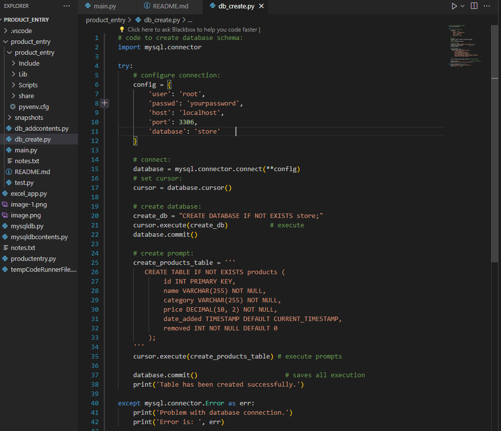

**Inserting Sample Data:**

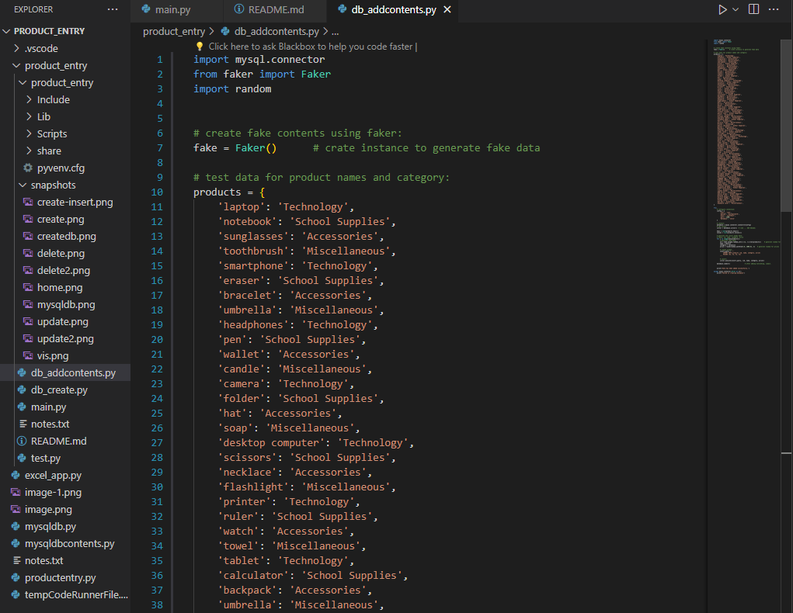

#### MAIN CODE:

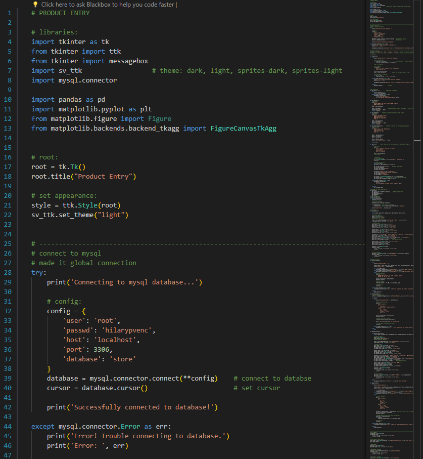
main.py

----
#### WHAT NEEDS TO BE IMPROVED:
* **classes** - the program though simple, in my opinion, can still be improved by adding classes. 
* **login system** - the login system can be used so that only registered user can alter the products.
* **refresh button** - it's an easy and minor issue, but I think it can make better UX.
* **web app** - I think instead of using tkinter, it is also possible to implement this in a we application and use frameworks like  `django`.

---
> Author: **`cyphe-did-it`**